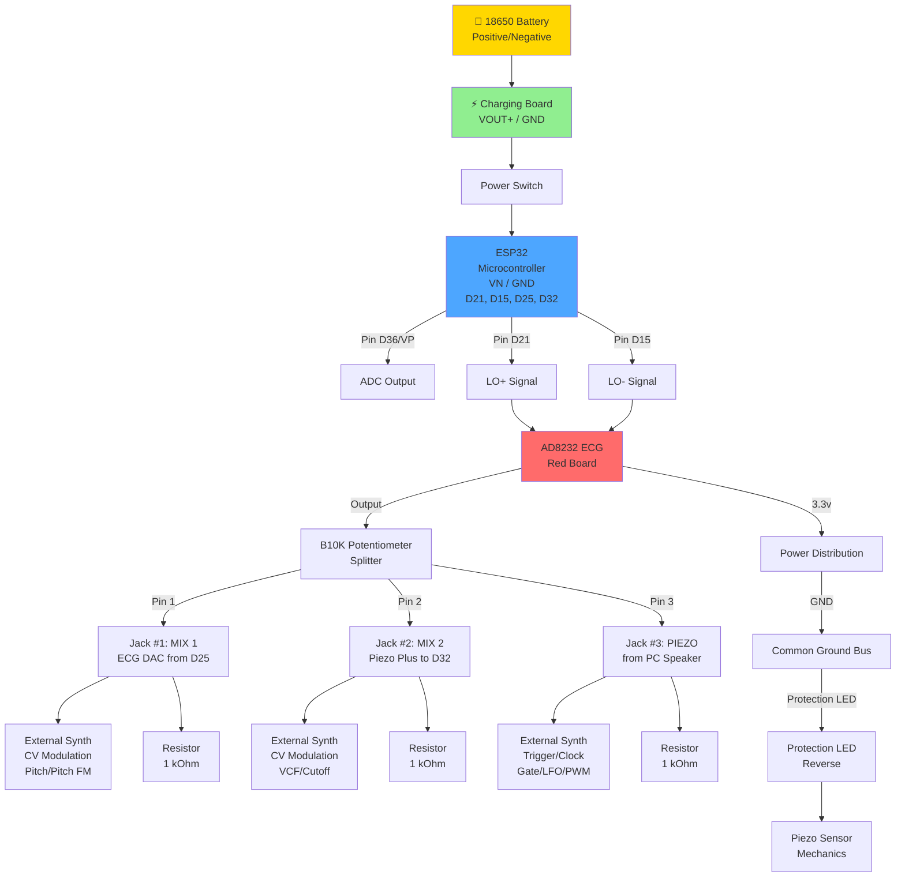

# Hardware Prototype

## pulseFlesh V1 System Schematic

## Компоненты

| Компонент | Функция | Пины |
|-----------|---------|------|
| 18650 Battery | Питание | B+/B- |
| Charging Board | Управление питанием | VOUT+/GND |
| ESP32 | Микроконтроллер | D21, D15, D25, D32, D36 |
| AD8232 ECG | ЭКГ датчик | LO+/LO-/Output |
| B10K Potentiometer | Сплиттер сигнала | 1/2/3 |
| Resistors (1kΩ) | Защита/согласование | - |

## Выходы

- **Jack #1 (MIX 1)** → External Synth (CV Modulation: Pitch/Pitch FM)
- **Jack #2 (MIX 2)** → External Synth (CV Modulation: VCF/Cutoff)
- **Jack #3 (PIEZO)** → External Synth (Trigger/Clock: Gate/LFO/PWM)
